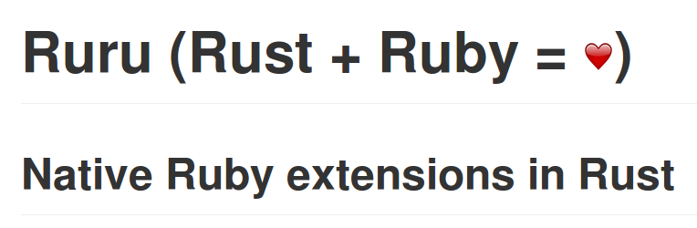
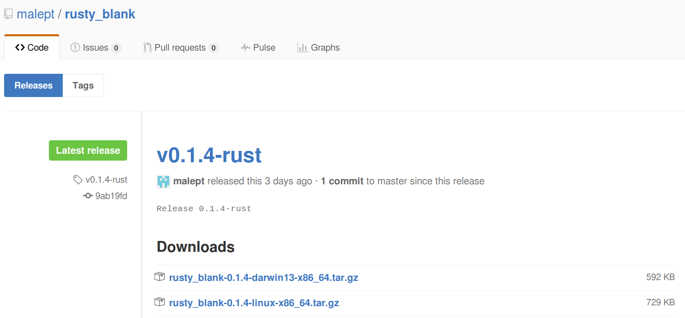

:skip-help: true
:css: hovercraft.css

.. title: Writing Rust for Fun (& Profit?), Part 2

----

:id: title-card

Writing Rust for Fun (& Profit?)
================================

Episode V: The Memory Safety Strikes Back
-----------------------------------------

.. image:: images/rustacean-orig-trans.png
   :alt: [Rustacean]
   :width: 50%
   :class: rustacean
   :target: http://www.rustacean.net/

Presenter: Mark Lee, Pythonista, Sometimes-Rubyist, and Novice Rustacean

May 06, 2016

.. note::
    Today I'm going to continue with my series on why Rust is awesome and why we should use it. In
    particular, I'm going to address a few things that I didn't have time to talk about last time,
    and also some status updates.

----

:id: previously

Previously on The Rust Wing…
~~~~~~~~~~~~~~~~~~~~~~~~~~~~

*drumroll*

.. note::

    In our last episode, we learned that Rust is a systems programming language, around 6 years old,
    with a bunch of interesting features like memory safety and a modern syntax I showed off some
    example code and two use cases: a speedup extension for Ruby, and a very simple webapp, both
    with benchmarks.

----

:id: rust-news

What's happened in the Rust ecosystem?
~~~~~~~~~~~~~~~~~~~~~~~~~~~~~~~~~~~~~~

* `Rust 1.8`_
* `Dropbox article`_ in *Wired*
* Rust's ``regex`` crate + C → `Rust regexes in Go`_

.. _Rust 1.8: http://blog.rust-lang.org/2016/04/14/Rust-1.8.html
.. _Dropbox article: http://www.wired.com/2016/03/epic-story-dropboxs-exodus-amazon-cloud-empire/
.. _Rust regexes in Go: https://github.com/BurntSushi/rure-go

.. note::

    Generally speaking, Rust 1.7 and then 1.8 were released in between talks. Given the project's
    six week release cycle, this isn't too surprising. A fair amount of the changes were related to
    stabilization of standard library functions.

    There's been some interesting third-party news since the last talk. Dropbox finally went public
    with how they're using Rust: they rewrote parts of their distributed filesystem (called "Magic
    Pocket") from Go. Their reasons included memory usage/control, easy FFI, and code
    safety/correctness.

    Speaking of Go, the author of the regular expression package for Rust recently wrote C bindings
    for it. To test them, he wrote a package that provides that regex engine to Go.

----

:id: cargo

Missing Topic: Cargo
~~~~~~~~~~~~~~~~~~~~

.. image:: images/Cargo-Logo-Small.png
   :target: https://crates.io
   :alt: [Cargo Logo]

.. note::

    One of the topics I missed last time was on package management. Rust does have it! The manager
    app is called ``cargo``, the packages are called crates, and the package index website lives at
    crates.io. Given that there are some prominent Rubyists working on this, it should not surprise
    you to learn that it is pretty similar to RubyGems and Bundler. You create a new Rust project by
    running ``cargo new`` (which is kind of similar to ``rails new``), you build the project with
    ``cargo build``, you update the dependencies with ``cargo update`` (which updates a ``.lock``
    file), and you publish a crate with ``cargo publish``. All very familiar commands.

----

:id: ruru

Ruru
~~~~

.. note::

    This is probably the most relevant topic. Last week, a Lithuanian developer released a crate
    that made it orders of magnitude easier to write Ruby extensions in Rust. This includes the
    ability to monkeypatch methods directly in Rust. Naturally, I jumped at the chance to stop
    writing C shims to get my Rust extensions to work. As I started to work on this project, there
    was a nagging voice in the back of my head that was saying, "Don't make everyone (including the
    app servers) have to download and install Rust if they don't need to!" So now I had two goals:
    make the Ruby gem download binary libraries if Rust isn't installed, and remove the C component
    of existing Rust-based extensions.

----

:id: optional-rustc

Step 1: Optional ``rustc``
~~~~~~~~~~~~~~~~~~~~~~~~~~

.. note::

    For step 1, I used the canonical example of a Rust-based Ruby extension: ``String.blank?``.

    After a few nights of experimentation, I came up with a Rake task that built the Rust library if
    Cargo was found, and if not, it would download the latest tagged release on GitHub for the given
    OS and architecture. GitHub binary releases are compiled and uploaded via Travis CI.

----

:id: decification

Step 2: De-Cification
~~~~~~~~~~~~~~~~~~~~~

Before
""""""

======== ===== ===== ======= ====
Language files blank comment code
======== ===== ===== ======= ====
*Ruby*       5    17      11   84
*Rust*       2    22       4   77
*C*          1     8       0   45
*make*       1     9       1   24
**SUM**      9    56      16  230
======== ===== ===== ======= ====

After
"""""

======== ===== ===== ======= ====
Language files blank comment code
======== ===== ===== ======= ====
*Ruby*       4    15       4   89
*Rake*       1     8       1   89
*Rust*       2    22       3   86
**SUM**      7    45       8  264
======== ===== ===== ======= ====

.. note::

    The second step was a bit more difficult. I ported the ``escape_hstore`` extension that I talked
    about last time. Due to the immaturity of the ruru crate, I ended up contributing a few
    features, including determining the type of Ruby values. In the end, if you ignore the build
    system code from the previous step, I ended up with net negative, more concise code in the
    extension, as you can see from the lines of code counter that I ran.

----

:id: interlude

Interlude
~~~~~~~~~

    Ruby doesn't really have a "C extension API" as much as it has "please link against my internals
    thanks."

    -- `Steve Klabnik <https://github.com/steveklabnik/rust_example#why-all-the-mess>`_

.. note::

    As an aside, in working on porting the extension to use Ruru, I was repeatedly reminded of this
    quote. I've hacked and/or written native extensions for three languages now, and by far, Ruby
    has the worst "interface". It is absolutely ridiculous a) how bad the docs are, and b) how many
    static functions and preprocessor macros are used. It turns out the Ruby value type code is
    almost all preprocessor macros, which is not FFI-friendly.

----

:id: benchmarks

Benchmarks, Take 2
~~~~~~~~~~~~~~~~~~

Rust 1.8, Ruby 2.3.1, Linux x86_64 *(Lenovo Yoga, Intel i7-4600U @ 2.10GHz, 8GB RAM)*

========== ======== ======== ======== ======== ========
**Rails**  0.339727 0.329724 0.327690 0.329705 0.326349
**Rust+C** 0.215731 0.212838 0.217413 0.215455 0.214668
**Ruru**   0.220376 0.218860 0.225751 0.217728 0.219013
========== ======== ======== ======== ======== ========

~35% speedup, difference between Rust + C hybrid & Ruru negligible

.. note::

    This project gave me an opportunity to redo my extension's benchmarks. My first set were a bit
    problematic, primarily because I was running on a pretty old version of Ruby on my personal
    laptop (which happens to be the default version of Ruby on Debian stable). I redid it with the
    latest Rust, Ruby, and crate dependencies, and it turns out that the original benchmark was only
    off by ~5%. Additionally, converting to pure Rust had a negligible speed cost.

----

:id: questions

Questions?
----------

.. image:: images/rust-logo-512x512.png
   :alt: [Rust Logo]
