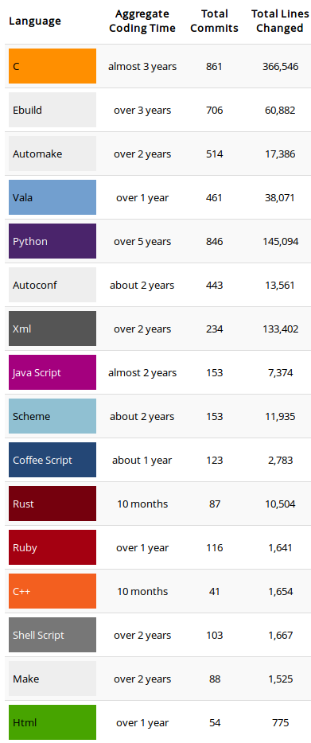

:skip-help: true
:css: hovercraft.css

.. role:: raw-html(raw)
   :format: html

.. title:: Writing Ruby+Rust for fun and profit!

----

:id: title-card

Writing Ruby+Rust for Fun and Profit!
=====================================

Presenter: Mark Lee - Pythonista, Rustacean, and Professional Rubyist

September 12, 2016

.. note::

    Hi, I'm Mark, and I'm going to talk about my journey to get Rust into production at my job.

----

:id: whoami

Who am I?
---------

.. |data-axle| image:: https://data-axle.com/assets/axle_web/logo-e3204544b43fb1a82dc44c17998d29f29a205570754cec9cb698589ad519f04f.png
   :alt: Data Axle
   :height: 30px
   :class: inline
   :target: https://data-axle.com/

* Software Engineer at |data-axle|
* Ruby by day, everything else by night

.. note::

    I work in Fremont at Data Axle, a tech division of Infogroup, which is a company that you
    haven't heard of unless you happen to be in the local business listings industry. Although
    chances are pretty good that you've used our data on some digital map or GPS unit when you're
    looking for some business or if they're open. Anyway, we're primarily a Rails shop, so I write
    mostly Ruby during the day.

----

:id: languages

.. note::

    In my off hours, you could say that I'm a bit of a polyglot.

----

:id: extensions

Extensions
----------

.. note::

    A fair percentage of that code are bindings or extensions to another language. I did make a
    small web app with Hyper, but I decided that writing a native Ruby extension in Rust would be a
    better way to ease my team into the idea of adding Rust into our ecosystem.

----

:id: extensions-pros

Pros
----

* Avoid reinventing the wheel
* Speed up hotspots

.. note::

    Very briefly, here are the pros and cons of native extensions in general. I've found that I can
    avoid reinventing the wheel if I just bind a native library to my language of choice. My first
    native extension was actually binding the reference C implementation of the tiger tree hash so
    that I could use it in a Python desktop app I was writing. The more popular reason to use an
    extension is to speed up either CPU- or RAM-bound areas in your code.

----

:id: extensions-cons

Cons
----

* Takes longer to develop
* Lower `bus factor <https://en.wikipedia.org/wiki/Bus_factor>`_

.. note::

    One of the downsides is that it takes longer to write. You can't really get away from that,
    unless your native programming language is so magical that it writes exactly like a higher-level
    language - Rust comes close, but not *that* close. The other big downside is related to the
    previous one - there's a lower bus factor due to the relatively higher complexity of a native
    programming language.

----

:id: escape_hstore

Case study: ``escape_hstore``
-----------------------------

* Rails (ActiveRecord+PostgreSQL) monkeypatch

.. note::

    My first attempt at a Rust extension for work was a little over a year ago. I was in the middle of refactoring an ETL project (extract, transform, load) and I was experimenting with outputting the result of the extract stage into PostgreSQL. My thought was to use the HSTORE extension, which is basically PostgreSQL's first attempt at a key-value store. I wanted to avoid column changes when the data layout changed. (These days, people tend to use PostgreSQL's binary json column, but this was before we had production access to a Postgres database with that feature.) The problem was that when I profiled it with a significant number of records, Rails's ActiveRecord implementation of serializing data into HSTORE SQL was a fairly big bottleneck. I really didn't want to write a pure C extension to handle this. I knew that if tried to add it to our system, the odds are it wouldn't make it due to the downsides I mentioned earlier. Also, I didn't really want to write all of that boilerplate memory management code, plus all of the extra build system work, because I would need at least a third party regular expression library. On the other hand, I had read about Rust, so I decided to take about a day and see if that would do what I wanted.

----

:id: escape_hstore-attempt-1

``escape_hstore``: Attempt 1
----------------------------

* Tied to nightly ``rustc``
* Partly written in C

.. note::
    The result was that I got something working, and it was somewhat faster than the pure Ruby version, but it was using the nightly version of Rust (because I had it in my head that I needed the ``regex!`` macro for speed), it was partly written in C (as the glue between Rust and Ruby), and I ran into other problems with HSTORE orthogonal to the extension, so it was put aside. After this experiment, it took me a couple more tries within the next year to get it working a) noticeably faster, and b) using a stable compiler. Among other things, I replaced the ``regex!`` macro with the ``lazy_static!`` macro, and also fixed a memory leak in my C glue code.

----

:id: escape_hstore-benchmarks

Current Benchmark
-----------------

========= ======== ======== ======== ======== ========
Benchmark Run 1    Run 2    Run 3    Run 4    Run 5
========= ======== ======== ======== ======== ========
**Rails** 0.393944 0.396805 0.396090 0.400217 0.400597
**Rust**  0.302957 0.306831 0.303744 0.301019 0.299960
========= ======== ======== ======== ======== ========

* Specs: AWS EC2 t2.medium, Ubuntu Linux 16.04 (amd64), Ruby 2.3.1, Rust 1.11.0
* TL;DR: ~25% speedup

.. note::

    I gave a talk at work about this, and my notes say that I wanted to see if I could rewrite it in this project called "turboruby", which by the next RailsConf would turn out to be "Helix". I would end up replacing the glue code with ruru, which has better docs and is overall better maintained. These are the current benchmarks.

----

:id: interlude

Interlude
~~~~~~~~~

    Ruby doesn't really have a "C extension API" as much as it has "please link against my internals
    thanks."

    -- `Steve Klabnik <https://github.com/steveklabnik/rust_example#why-all-the-mess>`_

.. note::

    As an aside, in working on porting the extension to use Ruru, I was repeatedly reminded of this
    quote. I've hacked and/or written native extensions for three languages now, and by far, Ruby
    has the worst "interface". It is absolutely ridiculous a) how bad the docs are, and b) how many
    static functions and preprocessor macros are used. It turns out the Ruby value type code is
    almost all preprocessor macros, which is not FFI-friendly.

----

:id: rust-ruby-integration

Making Rust+Ruby integration better
-----------------------------------

* Problem: adding a new dependency
* Solution: …?

.. note::

    In writing the extension, I was thinking about what it would take to get it into production. I
    was worried about two faces of the same coin: adding a new dependency. From a developer's
    perspective, that means that if you update the app with a required Rust extension, you need to
    tell all of the developers how to install and possibly configure Rusti/Cargo on their computer.
    Admittedly, even with ``multirust``, it wasn't that bad. But it's still an interrupt on their
    normal routine.

    The case that I was more worried about was adding a Rust dependency in production. For various
    reasons, we're not using containers at the moment. I really didn't want to add a Rust compiler
    on all of the production machines, because that would cause my DevOps coworker to start
    grumbling, and my general philosophy has been to keep DevOps generally… not annoyed. So I
    started to design a way to install gems with Rust extensions without needing a Rust
    installation. And I came up with…

----

:id: thermite

Thermite
--------

:raw-html:`<blockquote class="imgur-embed-pub" lang="en" data-id="NzXAzNK">Example of Thermite</blockquote>`

(`Reddit source <https://redd.it/3aiu78>`_, `YouTube source <https://youtu.be/tj7S_DNFgEU?t=3m52s>`_)

.. note::

    I named the gem "thermite". One of the reasons may have been an excuse to watch a bunch of
    chemical reaction videos.

----

:id: why-thermite

Why name it Thermite?
---------------------

.. |Al2O3| replace:: Al₂O₃
.. |Fe2O3| replace:: Fe₂O₃

* Ruby includes aluminum oxide (|Al2O3|)
* Rust: iron oxide (|Fe2O3|)
* A common thermite formula: |Fe2O3| + 2Al → 2Fe + |Al2O3|

.. note::

    But really, why name it Thermite? A cheap shot at humor. According to Wikipedia, Ruby (the
    gemstone) contains aluminum oxide. Rust (the orange stuff) is iron oxide. A common thermite
    reaction uses iron oxide and aluminum to produce iron and aluminum oxide. Also, somehow the gem
    name "thermite" wasn't taken.

----

:id: what-is-thermite

Seriously though, what is it?
-----------------------------

.. pull-quote::
    `Thermite <https://github.com/malept/thermite>`_ is a Rake-based helper for building and
    distributing Rust-based Ruby extensions.

.. note::

    Now that I've thoroughly explained the joke, I might as well describe what it does. The easiest
    way to do that is to quote the README.

----

:id: thermite-features

Thermite: Features
------------------

* Make it easy to configure and run ``cargo``
* Install the compiled extension in a location easily accessible by Ruby
* Allow users to install precompiled binaries from GitHub releases (or an arbitrary URL - coming soon)

.. note::

    Although it's primarily a wrapper around ``cargo``, the other big feature is that it allows the
    library developer to specify a location where users will automatically download and install
    precompiled versions of the extension, if ``cargo`` is not on their system. This is particularly
    useful when you don't want to impose a new language dependency on all of the developers, or the
    production infrastructure.

----

:id: six-easy-steps

Use Thermite in Six Easy Steps!
-------------------------------

1. Add ``thermite`` to your ``Gemfile``, run ``bundle``
2. Add to your gemspec:

   .. code:: ruby

       s.extensions << 'ext/Rakefile'
       s.add_runtime_dependency 'thermite', '~> 0'

3. Create ``ext/Rakefile``:

   .. code:: ruby

       require 'thermite/tasks'
       Thermite::Tasks.new

4. Load your extension via FFI + Thermite
5. ?
6. :raw-html:`<del>Profit!</del>` Performance!

.. note::

    I've tried to make it relatively simple to use. Add a gem, create a few files, some magic
    happens, and you're ready to write some fast code! Like a good project, the gem itself has
    unit tests, API docs, and hopefully a fairly comprehensive README.

----

:id: case-study-transliteration

Case Study: Transliteration
~~~~~~~~~~~~~~~~~~~~~~~~~~~

.. note::

    Since I wrote Thermite, I felt like I needed to write a gem that I could use to show concretely
    that we can add Rust to our ecosystem. The ``escape_hstore`` extension was nice, but we weren't
    actually using it. This past week, I found an area that could be easily sped up by Rust:
    transliteration.

----

:id: defining-transliteration

UTF-8 → ASCII
~~~~~~~~~~~~~

* ``é`` → ``e``
* ``—`` → ``-``
* ``®`` → ``(R)``

.. note::

    I should define what I mean by transliteration. In this case, it's the process taking characters
    outside of the ASCII character set and converting them into their ASCII "equivalent". For
    example, European characters with accents lose the accents, and traditional Chinese characters
    get converted to their pinyin equivalents. In this case, it's usually accented characters and
    punctuation that needs to get converted. We need to do this because we talk to systems outside
    of our control that only use the ASCII character set.

----

:id: i18n-gem

``i18n``
~~~~~~~~

* Dependency of ActiveSupport
* Pure Ruby

.. code:: ruby

    I18n.backend.store_translations(:en, i18n: {
      transliterate: { rule: custom_translations }
    })
    I18n.transliterate(input_string)

.. note::

    How does Rails help us with that? Part of Rails is this gem called ActiveSupport, which has a
    bunch of convenience methods and configurations that aren't in the Ruby standard library. It
    includes a dependency on the ``i18n`` gem, which is preconfigured so that we can transliterate
    strings with accented characters with a simple method call. If you want custom transliterations,
    it's slightly more work, but not too bad, as you can see.

----

:id: i18n-profile

``i18n`` Profile
~~~~~~~~~~~~~~~~

::

    allocated memory by file
    -----------------------------------
    [...]
    6266676  RUBY/openssl/buffering.rb
    6086560  GEMS/i18n-0.7.0/lib/i18n/backend/base.rb
    5742584  GEMS/activesupport-4.2.5/lib/active_support/dependencies.rb
    5291777  GEMS/i18n-0.7.0/lib/i18n/backend/transliterator.rb
    [...]

.. note::

    I've been helping a coworker with some optimizations lately, in particular, related to
    memory allocation. When I was looking at the memory profiler output, I noticed that the ``i18n``
    gem allocated and retained more memory than I was expecting, so I dug into it. It turns out that
    ``i18n``'s ``transliterate`` runs a Regexp replace with a method callback, and iterates
    character-by-character to see which ones need to be replaced. This allocates at least one object
    per character, which can get bad when you're running this on lots of large records.

----

:id: t12r

Enter: T12r
~~~~~~~~~~~

* Transliterator → T12r
* Rust: 45 LoC (not including tests)
* Ruby: 27 LoC (not including tests)

.. code:: ruby

    T12r.transliterate(input_string, custom_translations)

.. note::

    Since the bottleneck wasn't in our code, I decided to port transliterate to Rust, monkeypatch
    the ``i18n`` gem, and see what kind of speedup I get. Luckily for me, someone wrote a Rust crate
    to transliterate Unicode (rust-unidecode). The only thing I had to write, apart from the minimal
    ruru glue code, was support for "custom translations", which was pretty trivial - convert a Ruby
    hash into a Rust hash. All in all, it did not end up being that much code, less than 100
    lines total.

----

:id: t12r-profile

``t12r`` Profile
~~~~~~~~~~~~~~~~

::

    allocated memory by file
    -----------------------------------
    [...]
    6486233  RUBY/openssl/buffering.rb
    6086560  GEMS/i18n-0.7.0/lib/i18n/backend/base.rb
    5742584  GEMS/activesupport-4.2.5/lib/active_support/dependencies.rb
    [... 11 other files ...]
    2692249  T12R/lib/t12r/i18n_monkeypatch.rb
    [...]

    From the baseline profile earlier:
    5291777  GEMS/i18n-0.7.0/lib/i18n/backend/transliterator.rb

.. note::

    Turns out when I monkeypatch the ``i18n`` gem, the memory it allocates is cut very nearly
    in half.

----

:id: t12r-benchmarks

Benchmarks
~~~~~~~~~~

========================= ======== ======== ======== ======== ========
Benchmark                 Run 1    Run 2    Run 3    Run 4    Run 5
========================= ======== ======== ======== ======== ========
activesupport_unrealistic 9.229482 9.244237 9.207310 9.214158 9.303218
t12r_unrealistic          0.737353 0.736112 0.734379 0.737035 0.734893
activesupport_realistic   0.640747 0.632533 0.634910 0.636180 0.638756
t12r_realistic            0.315267 0.317564 0.315769 0.319236 0.316022
========================= ======== ======== ======== ======== ========

* Specs: AWS EC2 t2.medium, Ubuntu Linux 16.04 (amd64), Ruby 2.3.1, Rust 1.11.0
* Unrealistic benchmark (~13x speedup‽): 220 characters, 70% non-ASCII
* Realistic benchmark (~2x speedup):

  .. epigraph::
     Introducing: Slurm® Latté—Even more highly addictive!

.. note::

    Unfortunately running the memory profile script makes it more difficult to figure out if there
    are any speedups, so I wrote a quick benchmark script. It actually does two benchmarks - one
    with mostly special characters, and one with mostly normal characters. The special character
    benchmark was surprising, it was consistently around a 13x speedup. On the other hand, the
    benchmark with the more realistic text was closer to a 2x speedup. Not bad for less than 100
    lines of code. I presented these last few slides last Friday more or less verbatim, and it looks
    like I got the go-ahead to start integrating this gem into our system.

----

:id: questions

Questions?
----------
