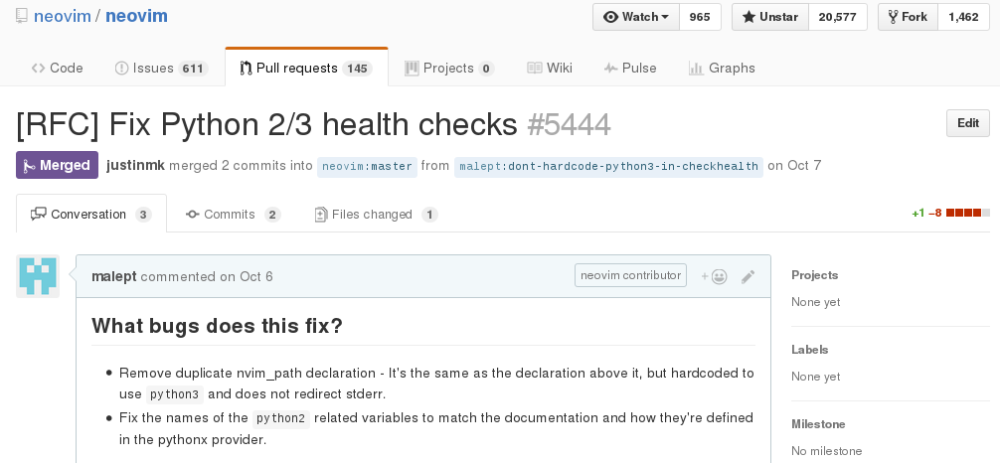

:skip-help: true
:css: hovercraft.css

.. role:: raw-html(raw)
   :format: html

----

:id: title-card

================================
Neovim: Vim for the 21st century
================================

.. image:: images/neovim-mark.svg
   :target: http://neovim.io
   :width: 400px

Presenter: Mark Lee, Vimmer for over 10 years

November 14, 2016

.. note::

    I've been asked to talk about why you should switch to Neovim. I'm not going to do that, per se.
    Editor wars are way too contentious, and I'm saying this as someone who has seen Saint IGNU-cius
    in person. This talk is more along the lines of "I think Neovim is cool and this is why".

----

:id: vi-history

In the beginning…
-----------------

There were line editors, starting with ``qed`` (1965). And then:

* ``ed`` (1969, Thompson/Ritchie)
* ``em`` (1976, Coulouris)
* ``en`` (1976, Haley/Joy)
* ``ex`` (1976, Joy)

``vi`` was a program designed to be a different, "visual" mode to ``ex``.

.. note::

    As always, I like to give historical context to my talks. It was pretty interesting to read
    about the lineage of Neovim, all the way back to 1965 with the ``qed`` line editor, back in the
    pre-UNIX days. ``qed`` gave way to ``ed`` (which you can use on our production servers for
    whatever reason) and eventually ``ex`` and ``vi``.

----

:id: vim-history

And then there was Vim
----------------------

* 1988 - a port of Stevie (Vi clone for Atari ST) to Amiga
* 1991-11-02 - First release (1.14)
* 1998-02-19 - Version 5.0 (syntax highlighting, VimL, GUIs)
* 2001-09-27 - Version 6.0 (diff, folding, UTF-8, i18n, **plugins**, **colorschemes**)
* 2006-05-08 - Version 7.0 (tabs, spellcheck, omnicomplete)

.. note::

    Vi spawned a whole series of clones, and Vim as we know it today was based off of one of them.
    This rough, truncated timeline gives you an idea of when some of the now-popular features were
    added. I'm pretty sure that I started using Vim in the early 2000s by downloading GVim for
    Windows.

----

:id: freezing-problems

Vim's Freezing Problems
-----------------------

* Plugins with CPU/IO-intensive code lock up the editor. Examples:

  * syntastic (syntax checker)
  * powerline (statusline enhancement)
  * vim-gitgutter

* Workarounds:

  * `vim-dispatch` (spawns new console or tmux pane)
  * `vimproc.vim` (calls native code to fork a new process)

.. note::

    Despite all of the improvements Vim made to the original Vi featureset, it was not without its
    limitations. The elephant in the room was its freezing problems. It was more-or-less fine with
    opening large files, but if a plugin happened to operate on one, that was another matter
    entirely. This was because Vim commands were all synchronous. The plugins listed were among the
    ones affected by this problem. Another example is if you use vim-bundler and run ``:Bundle``,
    because it uses the built-in ``:make`` command, you won't be able to edit any of your documents
    until Bundler finishes.

----

:id: neovim-history

Neovim Begins: With Multithreading?
-----------------------------------

* 2013-12-04: Experimental branch to introduce threading, by Thiago Arruda (BR)
* 2014-02-21: Bountysource fundraiser launched
* 2014-03-23: Raises $33,966 out of $10,000
* 2015-11-01: Neovim 0.1 released

.. note::

    At the end of 2013, one developer, Thiago Arruda, tried to fix this by adding multithreading to
    Vim. This resulted in zero feedback from Bram, Vim's creator. Frustrated by the development
    process, Thiago started a crowdsourced fundraiser so that he could work on a fork of Vim. It
    ended up raising more than three times the amount asked, and the first stable version was
    released about a year and a half later.

----

:id: initial-goals

Initial Goals
-------------

* Use GitHub, add more people with the "commit bit"
* Modern build system (cmake)
* Remove legacy OS support (e.g., MSDOS)
* Rewrite plugin architecture with async support
* Make it easier to integrate with GUIs
* Better tests

.. note::

    The initial goals ultimately point towards two ideas: increasing bus factor and development
    speed. I should point out that all of these high-level goals were achieved, although in some
    cases, the initial attempt at implementation did not go so well (as can be the case in software
    engineering).

----

:id: contributors-welcome

Contributors Welcome
--------------------

.. note::

    If that low barrier to entry weren't there, I probably wouldn't have contributed. Sending a
    patch to a mailing list is a lot more work than filing a pull request.

----

:id: bonus-features

Bonus Features
--------------

* Built-in terminal emulator
* Most of vim-sensible is set by default
* Better clipboard support out-of-the-box
* True color (24-bit) colorscheme support
* Helpful hints on how to get the most out of your Vim config (``:CheckHealth``)

.. note::

    In addition to my small bug fix, a host of features and ergonomic fixes have been made possible
    by this modern development process. For instance, the truecolor colorscheme support feature was
    a third-party patch since at least 2013. A version of that landed in Neovim in 2015. Another
    example is Tim Pope's vim-sensible project, which contains "sensible defaults" for Vim. Most of
    these settings are now part of the default Neovim config, and the rest have documentation as to
    why they were not added. My favorite of these might be the built-in terminal.

----

:id: inccommand

One more thing: incremental command live feedback
-------------------------------------------------

:raw-html:``

.. note::

    This last feature landed last week and so I haven't had a chance to try it out, but it looks
    pretty nifty. It reminds me of that Sublime Text multiple cursors feature.

----

:id: frontends

Neovim Frontends
----------------

* Good ol' terminal (Homebrew: ``brew install neovim/neovim/neovim``)
* Atom integration
* VimR (macOS)
* Multiple Electron apps
* SolidOak (Rust IDE‽)
* …and a `lot more <https://github.com/neovim/neovim/wiki/Related-projects#gui-projects>`_

.. note::

    Aside from the terminal UI, there are several third party frontends. I've only listed a few. By
    "Electron" I mean the Chromium-based app framework that lets you write desktop apps using web
    technologies. That's right, at least one person wrote a web component for Neovim.

----

:id: vim-status

Vim's status
------------

* Vim 8.0, released 2016-09-12 (~10 years after 7.0) with some familiar features:

  * Async support
  * Dropped support for certain legacy OSes
  * Truecolor colorscheme support
  * Better tests

.. note::

    The relative success of the Neovim project must have sparked something in Bram, because Vim
    started getting some of the more popular features of Neovim, and version 8 was released with
    these changes a couple of months ago. Still doesn't have a terminal, though.

----

:id: questions

Questions?
----------

.. image:: images/neovim-mark.svg
   :target: http://neovim.io
   :width: 400px
