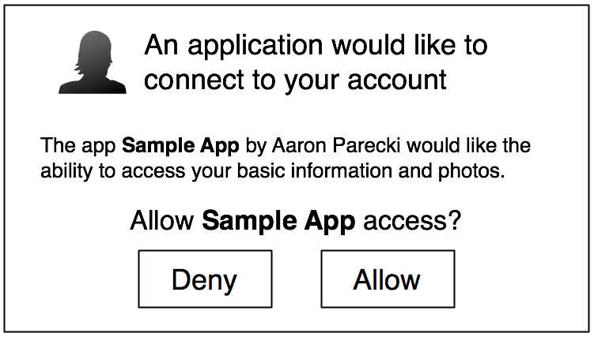

:skip-help: true
:css: hovercraft.css

.. title:: An Introduction to OpenID Connect

----

An Introduction to OpenID Connect
=================================

Presenter: Mark Lee

----

What is OpenID?
---------------

A set of open standards for decentralized authentication.

.. note::

   For context, prior to OpenID Connect, there were two earlier versions of OpenID that defined its
   own signature verified, URL-based callback workflow to transfer the user information to the
   website requesting authentication information. Meanwhile, OpenID Connect builds on top of
   OAuth 2.0.

----

Terminology
-----------

* Identity provider (IdP)
* Relying Party (RP)
* Claim
* ID Token

.. note::

   To get some of the common terminology out of the way, the identity provider is the "source of
   truth" for the given user's identity. The relying party is the website that wants to know that
   user's identity. A claim is "a piece of information about" a user. The ID token, unsurprisingly,
   is a JWT respresenting the authenticated user.

----

Diagram
-------

.. image:: images/OpenIDConnect-Map-4Feb2014.png
   :alt: [Protocol Suite & Underpinnings Diagram]

.. note::

   In terms of the protocol suite shown in the diagram, we're primarily going to talk about the core
   spec, and to a lesser extent, the discovery spec.

----

Sidebar: A Quick Intro to OAuth 2.0
-----------------------------------

.. image:: images/Oauth_logo.svg
   :alt: [OAuth logo]

.. note::
   First, let's dive into the OAuth 2 protocol to see how some of the underlying protocol works.

----

OAuth 2.0: Protocol Flow
------------------------

.. code::

   +--------+                               +---------------+
   |        |--(1)- Authorization Request ->|   Resource    |
   |        |                               |     Owner     |
   |        |<-(2)-- Authorization Grant ---|               |
   |        |                               +---------------+
   |        |
   |        |                               +---------------+
   |        |--(3)-- Authorization Grant -->| Authorization |
   | Client |                               |     Server    |
   |        |<-(4)----- Access Token -------|               |
   |        |                               +---------------+
   |        |
   |        |                               +---------------+
   |        |--(5)----- Access Token ------>|    Resource   |
   |        |                               |     Server    |
   |        |<-(6)--- Protected Resource ---|               |
   +--------+                               +---------------+

.. note::
   This is actually taken from the `draft RFC for OAuth 2.1`_, which is OAuth 2.0 but incorporates
   all of the errata since it was published. The resource owner is the user.In many cases, the
   authorization server and resource server are the same thing.

.. _draft RFC for OAuth 2.1: https://tools.ietf.org/html/draft-parecki-oauth-v2-1-03#section-1.2

----

OAuth 2.0: Terminology
----------------------

Scope
   Comma separated list of information the client wants to access

Grant
   A way of getting authorization from a resource owner

Client ID
   Opaque token known by server & client, passed to identify the client

Client Secret
   Opaque token known by server & client, not passed to the server via a web browser

----

OAuth 2.0: Grant Types
----------------------

* Authorization Code
* PKCE
* Client Credentials
* Device Code
* Refresh Token

Deprecated:

* Implicit Flow
* Password

.. note::
   There are a number of grant types defined by the OAuth 2.0 spec. I'm going to talk about the
   non-deprecated ones.

----

Authorization Code
------------------

.. code::

   GET /authorize?
   {
     response_type: code
     client_id: CLIENT_ID
     redirect_uri: URI
     scope: name email
     state: abcd1234
   }

.. note::
   The authorization code grant type is the typical way a website uses OAuth. For readability's
   sake, I've converted this URL query string and subsequent ones into JSON. Note that the ``scope``
   parameter is space-delimited.

----

Authorization Code: Prompt
--------------------------

.. note::
   After a resource owner logs in, on the authorize page, they are usually presented with a
   confirmation page similar to the mockup shown here. If the app is considered "trusted", this
   page could be skipped.

----

Authorization Code: Redirect
----------------------------

.. code::

   302 Found
   Location: URI?
   {
     code: AUTHORIZATION_CODE
     state: abcd1234
   }

.. note::
   The user is then redirected back to the OAuth client.

----

Authorization Code: Access Token
--------------------------------

.. code::

   POST /token
   {
     grant_type: authorization_code
     code: AUTHORIZATION_CODE
     redirect_uri: URI
     client_id: CLIENT_ID
     client_secret: CLIENT_SECRET
   }

   ----

   200 OK

   {
     access_token: 123token
     expires_in: 3600
     token_type: bearer
     refresh_token: refresh1 # optional
     scope: name email # optional if the user didn't change the allowed scopes
   }

.. note::
   The client can now use the authorization code to retrieve an access token. If the server
   supports it, it can also specify a refresh token which we'll cover later.

----

Proof Key for Code Exchange (PKCE)
----------------------------------

(*pronounced pixie*)

.. code::

   GET /authorize?
   {
     ...
     code_challenge: 1234abcd
     code_challenge_method: S256
   }

.. note::
   This is an extension to authorization code in that it effectively adds CSRF support to the
   authorization code method. The original use case for this was for mobile apps, but has since
   been recommended for server-side apps as well.

----

Client Credentials
------------------

.. code::

   POST /token
   {
     grant_type: client_credentials
     client_id: CLIENT_ID
     client_secret: CLIENT_SECRET
   }

.. note::
   The Client Credentials grant is used when applications request an access token to access their
   own resources, not on behalf of a resource owner.

----

Device Code
-----------

.. image:: images/sign-in-phone-hbo-max.jpg
   :alt: [HBO MAX example of a device code UI]
   :target: https://techwiser.com/wp-content/uploads/2020/12/sign-in-phone-hbo-max.jpg

.. note::
   This is basically the flow that happens when you pair a streaming service like YouTube or
   HBO MAX to your smart TV.

----

Refresh Code
------------

.. code::

   POST /token
   {
     grant_type: refresh_token
     refresh_token: refresh1
   }

.. note::
   Finally, the refresh code grant type allows for clients to request new access tokens before they expire.

----

How OpenID Connect uses OAuth 2.0
---------------------------------

* Required scope: ``openid``
* Optional pre-defined scopes (which map to claims):
   * ``profile``
   * ``email``
   * ``address``
   * ``phone``
* ``id_token`` is given alongside the ``access_token`` when accessing the token endpoint
* The user info endpoint provides the claim data defined by the above scopes

----

OpenID Connect: Discovery
-------------------------

.. code:: http

   GET /.well-known/openid-configuration HTTP/1.1
   Host: example.com

.. code:: http

   HTTP/1.1 200 OK
   Content-Type: application/json

   {
     "issuer": "https://id.example.com",
     "authorization_endpoint": "https://id.example.com/openid/authorize",
     "token_endpoint": "https://id.example.com/openid/token",
     "token_endpoint_auth_methods_supported": ["client_secret_basic", "private_key_jwt"],
     "token_endpoint_auth_signing_alg_values_supported": ["RS256", "ES256"],
     "userinfo_endpoint": "https://id.example.com/openid/userinfo",
     "jwks_uri": "https://id.example.com/openid/jwks",
     "response_types_supported": ["code"],
     "grant_types_supported": ["authorization_code"], "//": "optional",
     "subject_types_supported":  ["public", "pairwise"],
     "id_token_signing_alg_values_supported": ["RS256"]
   }

.. note::
   As mentioned earlier, the `discovery spec`_ is a separate spec from the `core spec`_. It
   describes a well-known URI endpoint that returns various metadata about the OpenID Connect
   implementation.

.. _discovery spec: https://openid.net/specs/openid-connect-discovery-1_0.html
.. _core spec: https://openid.net/specs/openid-connect-core-1_0.html

----

Questions❓
------------

